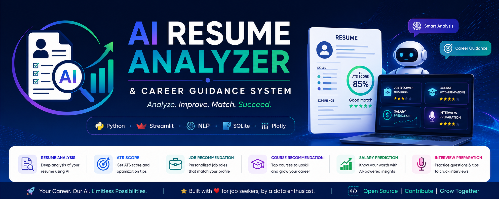
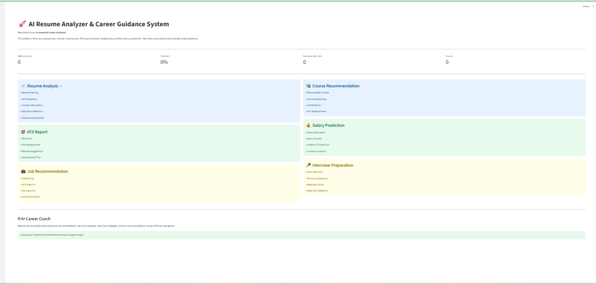

<p align="center">
  
</p>

<h1 align="center">🤖 AI Resume Analyzer & Career Guidance System</h1>

<p align="center">
An AI-powered Resume Analyzer built using <b>Python</b>, <b>Streamlit</b>, <b>SQLite</b>, <b>NLP</b>, and <b>Machine Learning</b> that helps job seekers analyze resumes, improve ATS compatibility, discover suitable career opportunities, predict salaries, and prepare for interviews.
</p>

<p align="center">


</p>

---

# 📌 Overview

The **AI Resume Analyzer & Career Guidance System** is an intelligent career assistant that helps candidates evaluate their resumes and improve their chances of landing their dream jobs.

The application performs end-to-end resume analysis, ATS compatibility evaluation, skill extraction, job recommendations, salary prediction, interview preparation, and personalized career guidance through an intuitive Streamlit interface.

---

# 🚀 Features

## 📄 Resume Analysis
- Resume Parsing (PDF & DOCX)
- Personal Information Extraction
- Education Detection
- Experience Analysis
- Technical Skill Extraction
- Resume Statistics Dashboard

---

## 🎯 ATS Resume Report

- ATS Compatibility Score
- Resume Strength Analysis
- Missing Keywords Detection
- Resume Improvement Suggestions
- Keyword Optimization
- ATS Readiness Evaluation

---

## 💼 Job Recommendation Engine

- AI-Based Job Matching
- Skill-Based Career Suggestions
- Experience-Based Recommendations
- Personalized Career Paths
- Job Fit Analysis

---

## 📚 Course Recommendation System

- Skill Gap Identification
- Personalized Learning Recommendations
- Technology-Based Courses
- Career Growth Roadmap

---

## 💰 Salary Prediction

- Salary Estimation
- Experience-Based Prediction
- Education-Based Analysis
- Industry Insights

---

## 🎤 Interview Preparation

- Interview Readiness Score
- Technical Interview Questions
- HR Interview Questions
- Communication Tips
- Interview Preparation Guide

---

# 🛠 Tech Stack

### Programming Language

- Python

### Frontend

- Streamlit

### Database

- SQLite

### Data Processing

- Pandas
- NumPy

### Visualization

- Plotly

### Machine Learning / AI

- NLP
- Skill Extraction
- Rule-Based Recommendation System

### Document Processing

- PyPDF2
- python-docx

---

# 📂 Project Structure

```text
AI_RESUME_ANALYSER/
│
├── app.py
├── requirements.txt
├── resume_analyzer.db
│
├── assets/
│   ├── banner/
│   ├── logo/
│   ├── screenshots/
│   ├── css/
│   └── fonts/
│
├── datasets/
├── notebook/
├── pages/
├── reports/
├── uploads/
├── utils/
└── README.md
```

---

# 📷 Application Screenshots

## 🏠 Home Page



---

## 📄 Resume Analysis


---

## 🎯 ATS Report


---

## 💼 Job Recommendation


---

## 📚 Course Recommendation


---

## 💰 Salary Prediction


---

## 🎤 Interview Preparation


---

# ⚙ Installation

## Clone the Repository

```bash
git clone https://github.com/YOUR_USERNAME/AI-Resume-Analyzer-Career-Guidance-System.git
```

Move into the project folder

```bash
cd AI-Resume-Analyzer-Career-Guidance-System
```

Install dependencies

```bash
pip install -r requirements.txt
```

Run the application

```bash
streamlit run app.py
```

---

# 💻 Technologies Used

- Python
- Streamlit
- SQLite
- Pandas
- NumPy
- Plotly
- PyPDF2
- python-docx
- NLP

---

# 🎯 Future Enhancements

- 🤖 AI Career Coach
- 📄 Resume vs Job Description Matching
- ✍ AI Resume Rewriting
- 📨 AI Cover Letter Generator
- 🌐 Cloud Deployment
- 🔐 User Authentication
- 📊 Recruiter Dashboard
- 🤝 LinkedIn Integration

---

# 📈 Project Highlights

- End-to-End AI Resume Analysis
- ATS Resume Evaluation
- Intelligent Job Recommendation
- Personalized Course Recommendation
- Salary Prediction
- Interview Preparation
- Interactive Dashboard
- Modular Architecture
- SQLite Database Integration
- Professional Streamlit Interface

---

# 👨‍💻 Author

**Jyothsna Raghunath**

Data Science | Machine Learning | Artificial Intelligence

GitHub: https://github.com/Jyo-12

LinkedIn: https://linkedin.com/in/https://www.linkedin.com/in/jyothsna-raghunath-3462041b5

---

# ⭐ Support

If you found this project helpful, consider giving it a ⭐ on GitHub!

---

